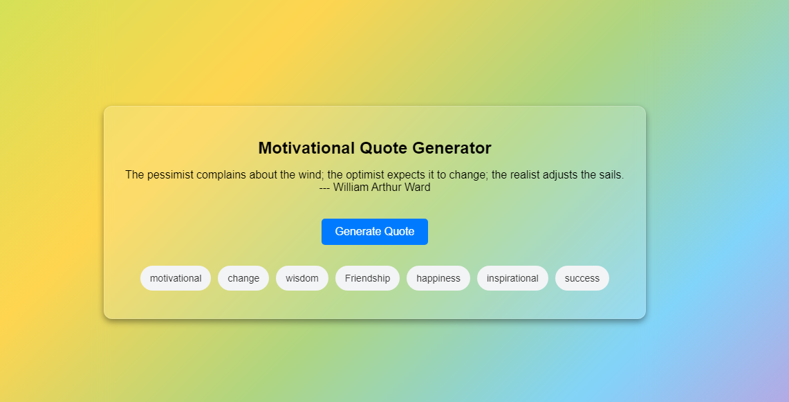

# Motivational Quote Generator


## 🌟 Overview
The **Motivational Quote Generator** is a simple yet powerful web application that fetches and displays motivational quotes at the click of a button. This project was built to **exemplify JavaScript concepts** such as DOM manipulation, ES6+ features, and more.

## 🚀 Live Demo



🔗 [Try it here on GitHub Pages](https://yourusername.github.io/motivational-quote-generator/)

## ✨ Features
- 🎯 Fetches **random motivational quotes** from a **local JSON file**.
- 🌂 **Tag-based filtering** to generate quotes based on specific themes.
- 🎭 **Dynamic background gradient** changes based on selected tags.
- ⚡ Built with **modern JavaScript (ES6+)** features.
- 🔥 **Minimalistic & responsive design**.

## 🛠️ Tech Stack & Concepts Used
- **JavaScript (ES6+)** – Arrow functions, async/await, fetch API, destructuring.
- **HTML & CSS** – Responsive layout, clean UI.
- **Local JSON Data** – Fetching quotes from a static file instead of an API.
- **DOM Manipulation** – Handling user interactions, updating elements dynamically.
- **Event Listeners** – Handling user input efficiently.
- **Optional Chaining** – Ensuring safe property access.
- **Spread Operator & Array Methods** – Efficient data handling.
- **ES Modules** – Modular JavaScript for maintainability.

## 🛠️ Installation & Setup
To run the project locally, follow these steps:

```bash
# Clone the repository
git clone https://github.com/yourusername/motivational-quote-generator.git

# Navigate to the project folder
cd motivational-quote-generator

# Open index.html in your browser
```

## 🎮 How to Use
1. Open the **live demo** or run the project locally.
2. Click the **"Generate Quote"** button to get an inspiring quote.
3. Select **tags** to filter quotes by category.
4. Watch the background color **change dynamically** based on your selection!

## 📚 JavaScript Concepts & Examples
Below are some key JavaScript concepts used in this project along with relevant code examples:

### **1. Funciones en JavaScript**
**Ejemplo:** Creación de una función con parámetros por defecto.
```js
export async function fetchRandomQuote(options = {}) {
    const tags = options.tags || '';
}
```

### **2. Objetos en JavaScript**
**Ejemplo:** Definición de un objeto con propiedades.
```js
export const tagColors = {
    motivational: '#FFDDC1',
    change: '#D4E157',
    wisdom: '#FFD54F',
};
```

### **3. Manipulación del DOM**
**Ejemplo:** Creación dinámica de elementos con `document.createElement`.
```js
export function renderTagCheckboxes(container) {
    const label = document.createElement('label');
    const checkbox = document.createElement('input');
    checkbox.type = 'checkbox';
    label.appendChild(checkbox);
    container.appendChild(label);
}
```

### **4. Objetos como parámetros de funciones**
**Ejemplo:** Paso de un objeto como argumento y acceso a sus propiedades.
```js
async function generateAndDisplayQuote() {
    const quote = await fetchRandomQuote({ tags: getSelectedTags(tagsContainer) });
}
```

### **5. Funciones anónimas**
**Ejemplo:** Uso de una función anónima en un manejador de eventos.
```js
generateButton.addEventListener('click', function () {
    generateAndDisplayQuote();
});
```

### **6. Arrow Functions**
**Ejemplo:** Uso de una función flecha con `map`.
```js
const lowerCaseTags = quote.tags.map(tag => tag.toLowerCase());
```

### **7. Return y condicionales**
**Ejemplo:** Uso de `return` para evitar `else`.
```js
if (filteredQuotes.length === 0) {
    return "No quotes available for the selected tags.";
}
```

### **8. String Literals**
**Ejemplo:** Uso de *template literals* para interpolar variables.
```js
throw new Error(`Error loading quotes: ${response.status}`);
```

### **9. Métodos de Arrays**
**Ejemplo:** Uso de `filter` y `map` en un array.
```js
filteredQuotes = allQuotes.filter(quote => quote.tags.map(tag => tag.toLowerCase()).includes('motivational'));
```

### **10. Spread Operator**
**Ejemplo:** Uso del operador de propagación en un objeto.
```js
const newTagColors = { ...tagColors, newTag: '#123456' };
```

### **11. Módulos de ECMAScript**
**Ejemplo:** Importación de funciones desde otro archivo.
```js
import { fetchRandomQuote } from './quotes.js';
```

### **12. Optional Chaining**
**Ejemplo:** Uso del operador `?.` para evitar errores de propiedades indefinidas.
```js
if (!Array.isArray(quote.tags?.map)) {
    return false;
}
```

### **13. Fetch, Promesas y Async/Await**
**Ejemplo:** Uso de `fetch` con `async/await` para obtener datos asíncronamente.
```js
const response = await fetch('quotes.json');
const allQuotes = await response.json();
```

## 🗂️ Folder Structure
```
/motivational-quote-generator
│── /assets
│   ├── favicon.ico        # Favicon for the project
│   ├── quotes.json        # Local JSON file containing quotes
│── /js
│   ├── script.js          # Main JavaScript file
│   ├── quotes.js          # Handles fetching quotes from JSON
│   ├── tags.js            # Tag selection logic
│   ├── background.js      # Dynamic background changes
│── /styles
│   ├── styles.css         # Styling and responsiveness
│── index.html             # Main HTML file
│── README.md              # Project documentation
```

## ❓ Why Switch to a Local JSON File?
Initially, the project used the **Quotable API** to fetch quotes dynamically. However, due to **SSL certificate issues**, the API was no longer reliable. To ensure the application remains functional, all quotes are now stored in a **local JSON file (quotes.json)**, eliminating any external dependencies.

## 🎉 Acknowledgments
- **[Icons8](https://icons8.com/)** – For the favicon icon.

---
Made with ❤️ by [Javier Murúa](https://www.linkedin.com/in/JavierMurua)

